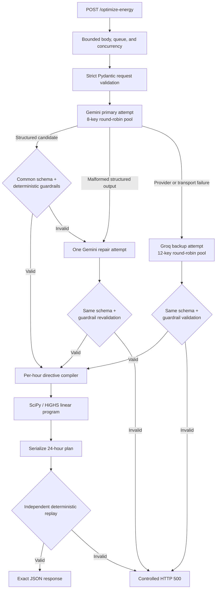

# Gridlock-d

**GridWise LLM-Assisted Operator Directive Interpretation — BUP CSE Fest 2026 Preliminary**

[Production API](https://gridlock-d.onrender.com) · [Health check](https://gridlock-d.onrender.com/health)

Gridlock-d converts 1–3 natural-language operator notes into machine-checkable energy directives, validates them deterministically, and solves a minimum-cost 24-hour energy schedule. The service exposes exactly the two endpoints required by the competition:

```text
GET  /health
POST /optimize-energy
```

## Architecture



Gemini is the normal path. Groq is called only after a Gemini provider/transport failure; it is not called after Gemini succeeds. A malformed Gemini result or a Gemini guardrail failure receives at most one Gemini repair attempt. Therefore, every request makes at most two model calls. The complete queue-to-response path has a 29-second deadline, preserving margin below the official 30-second timeout.

### Responsibility boundaries

- **LLM:** interprets all 1–3 notes in one structured request and maps each note to one of the six official types: `solar_reduction`, `minimum_battery_reserve`, `no_charge_window`, `no_discharge_window`, `max_grid_window`, or `no_op`. Its validated output directly creates optimizer constraints; it is not used for scheduling arithmetic.
- **Guardrails:** verify note coverage/order, directive shape, `applies`/`no_op` semantics, whole-hour windows, numeric meaning, bounds, and battery-capacity-relative reserves.
- **Directive compiler:** converts the validated interpretation into effective solar, active reserve, charge/discharge availability, and grid-cap arrays.
- **Optimizer:** uses a signed battery-flow linear program to minimize total grid cost while enforcing energy balance, battery limits, directives, and end-of-day neutrality.
- **Replay validator:** independently checks the serialized 24-hour plan, every directive, every battery transition, hourly energy balance, solar limits, final battery state, and recalculated totals before HTTP 200 is returned.

No phrase-matching rule replaces the language model, and invalid model output is never silently converted into a directive.

## Production API

The judge-facing API requires no authentication, login, dashboard, VPN, or manual approval.

Health:

```bash
curl https://gridlock-d.onrender.com/health
# {"status":"ok"}
```

Optimization using the included [request](examples/request.json):

```bash
curl -X POST https://gridlock-d.onrender.com/optimize-energy \
  -H "Content-Type: application/json" \
  --data-binary @examples/request.json
```

See the complete, valid [example response](examples/response.json). It includes the echoed `scenario_id`, one ordered interpretation per note, 24 ordered plan entries, independently recalculated totals, and a short summary.

## Local quickstart

Requirements: Python 3.11 or 3.12, internet access, and at least one Gemini API key.

### Windows Command Prompt

```cmd
git clone https://github.com/XGNoir95/Gridlock-d.git
cd Gridlock-d
py -3.12 -m venv .venv
.venv\Scripts\python.exe -m pip install --require-hashes -r requirements.lock
copy .env.example .env
```

Set at minimum `GEMINI_MODEL` and `GEMINI_API_KEY_1` in `.env`, then start the service:

```cmd
.venv\Scripts\python.exe -m uvicorn app.main:app --host 0.0.0.0 --port 8000
```

In another terminal:

```cmd
curl http://127.0.0.1:8000/health
curl -X POST http://127.0.0.1:8000/optimize-energy -H "Content-Type: application/json" --data-binary "@examples/request.json"
```

### Linux/macOS

```bash
git clone https://github.com/XGNoir95/Gridlock-d.git
cd Gridlock-d
python3.12 -m venv .venv
.venv/bin/python -m pip install --require-hashes -r requirements.lock
cp .env.example .env
# Set GEMINI_MODEL and GEMINI_API_KEY_1 in .env.
.venv/bin/python -m uvicorn app.main:app --host 0.0.0.0 --port 8000
```

## Configuration

The production model configuration, independently qualified before deployment, is:

- Primary: `gemini-3.5-flash-lite`
- Backup: `openai/gpt-oss-120b` through Groq

| Variable | Requirement | Purpose |
|---|---|---|
| `GEMINI_MODEL` | Required | Gemini model identifier |
| `GEMINI_API_KEY_1` … `GEMINI_API_KEY_8` | At least one | Primary round-robin credential pool |
| `GROQ_MODEL` | Optional with Groq keys | Backup model identifier |
| `GROQ_API_KEY_1` … `GROQ_API_KEY_12` | Optional with model | Backup round-robin credential pool |
| `LLM_TIMEOUT_SECONDS` | Optional; default `4` | Timeout for one provider attempt |
| `LLM_HARD_REQUEST_DEADLINE_SECONDS` | Optional; default `9`, max `29` | Total model-stage deadline |
| `LLM_KEY_COOLDOWN_SECONDS` | Optional; default `60` | Cooldown after auth/rate rejection |
| `TOTAL_REQUEST_DEADLINE_SECONDS` | Optional; default/max `29` | Queue-to-response deadline, below the official 30-second limit |
| `MAX_REQUEST_BODY_BYTES` | Optional; default `262144` | Reject oversized bodies before JSON parsing or model use |
| `MAX_CONCURRENT_OPTIMIZATIONS` | Optional; default `16` | Maximum active optimization requests per process |
| `MAX_QUEUED_OPTIMIZATIONS` | Optional; default `64` | Maximum waiting optimization requests per process |
| `PORT` | Optional; default `8000` | HTTP port |

The normal path uses one Gemini call. A Gemini schema/guardrail failure permits one Gemini repair. A Gemini provider failure permits one Groq backup call. Every request is capped at two model calls.

## Verification

Install development dependencies before running local checks:

```cmd
REM Windows Command Prompt
.venv\Scripts\python.exe -m pip install --require-hashes -r requirements-dev.lock
.venv\Scripts\python.exe -m ruff check .
.venv\Scripts\python.exe -m pytest
.venv\Scripts\python.exe -m pip check
.venv\Scripts\python.exe -m pip_audit --strict -r requirements.lock
```

```bash
# Linux/macOS
.venv/bin/python -m pip install --require-hashes -r requirements-dev.lock
.venv/bin/python -m ruff check .
.venv/bin/python -m pytest
.venv/bin/python -m pip check
.venv/bin/python -m pip_audit --strict -r requirements.lock
```

Current deterministic result: **57 tests passed**, lint passed, dependency integrity passed, and the runtime dependency audit found no known vulnerabilities.

### Official public samples

With the service running and the organizer JSON beside the repository:

```bash
.venv/bin/python scripts/run_public_samples.py \
  ../BUP_CSE_FEST_2026_Participant_Docs/BUP_CSE_FEST_2026_Preli_Public_Sample_Cases.json
```

To verify the deployed API instead:

```bash
.venv/bin/python scripts/run_public_samples.py \
  ../BUP_CSE_FEST_2026_Participant_Docs/BUP_CSE_FEST_2026_Preli_Public_Sample_Cases.json \
  --base-url https://gridlock-d.onrender.com
```

On Windows Command Prompt, replace `.venv/bin/python` in the two commands above with `.venv\Scripts\python.exe`.

Expected result: `SAMPLE-01: pass` through `SAMPLE-10: pass`. The runner checks official directive semantics, independently replays every schedule against organizer ground truth, and compares the optimum cost within the official `0.01` tolerance. All ten samples have passed against the public deployment.

### Live model qualification

```bash
.venv/bin/python scripts/qualify_llm_providers.py --provider gemini --passes 3 --delay-seconds 1.5
.venv/bin/python scripts/qualify_llm_providers.py --provider groq --passes 3 --delay-seconds 0.5
```

On Windows Command Prompt, replace `.venv/bin/python` with `.venv\Scripts\python.exe`.

Each provider is tested independently across the ten official interpretations plus ten adversarial/paraphrase cases. Current results:

| Provider | Model | Result | Median qualification latency | Maximum qualification latency |
|---|---|---:|---:|---:|
| Gemini | `gemini-3.5-flash-lite` | 60/60 | 1.405 s | 2.226 s |
| Groq | `openai/gpt-oss-120b` | 60/60 | 1.855 s | 4.812 s |

## Docker fallback

Build and run locally:

```bash
docker build -t gridlock-d:local .
docker run --rm -p 8000:8000 --env-file .env gridlock-d:local
```

The image binds to `0.0.0.0`, exposes port `8000`, runs as non-root UID/GID `10001`, includes a health check, and does not copy `.env` or test/development files.

Public fallback image:

```bash
docker pull ghcr.io/xgnoir95/gridlock-d:v1.0.2
docker run --rm -p 8000:8000 --env-file .env ghcr.io/xgnoir95/gridlock-d:v1.0.2
curl http://127.0.0.1:8000/health
# {"status":"ok"}
```

Immutable image reference:

```text
ghcr.io/xgnoir95/gridlock-d@sha256:de5fa62f5c4dcee5f5a3be84843aa9b2052f3ad791fb830c69742a4b1b3e2a14
```

The public `v1.0.2` image was independently pulled from GHCR, started as a fresh container, and verified through `GET /health`. The immutable digest above is the preferred submission reference.

## CI/CD and failure behavior

- CI runs Ruff, pytest, a runtime dependency vulnerability audit, a Docker build, and a container health smoke test on every push and pull request.
- Tagged releases run the same verification and publish a Linux/AMD64 image with provenance and an SBOM.
- CI actions, the Docker base image, and Python dependencies are immutable-pinned; dependency installation verifies package hashes.
- Malformed or structurally invalid requests return HTTP `400`.
- Model, guardrail, solver, or replay failures return a controlled HTTP `500` without raw stack traces, prompts, provider bodies, or secrets.
- FastAPI documentation routes are disabled; the public surface contains only the two official endpoints.

## Security and limitations

- Secrets are read only from environment variables. `.env` is excluded from Git and Docker build context.
- The service accepts only the bounded official shape: 1–3 notes, exactly 24 unique hours, a 1,024-character scenario ID, and at most 16,384 characters per note. Bodies over 256 KiB are rejected before model use.
- Active and queued optimization work is bounded while `/health` remains independent, and the full optimization path is capped at 29 seconds.
- Provider HTTP clients are closed during application shutdown; API responses are non-cacheable and include defensive content-type/referrer headers.
- Availability depends on hosted-model credentials, quota, rate limits, network access, and deployment uptime.
- Like every probabilistic language-model system, unseen phrasing can still be misinterpreted; strict structured output, deterministic guardrails, controlled repair/fallback, qualification cases, and final replay limit its impact without replacing the required LLM with hard-coded rules.
- Groq backup requires both a model identifier and at least one Groq key; otherwise it remains disabled.
- Contradictory overlapping solar-reduction factors are rejected because the official specification does not define their composition. Official scoring scenarios are guaranteed not to require contradictory hard directives.

## Technology and acknowledgements

Python, FastAPI, Pydantic, HTTPX, SciPy/HiGHS, Uvicorn, pytest, Ruff, Docker, GitHub Actions, Google Gemini API, and Groq API. OpenAI Codex and Anthropic Claude were used as engineering/review assistants; the submitted architecture, deterministic guardrails, optimizer, replay validation, and tests are implemented in this repository.
